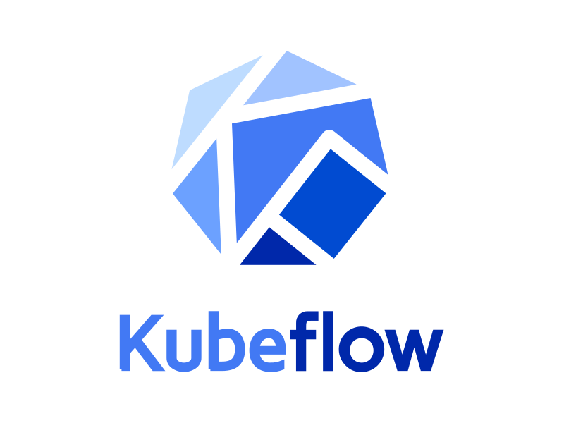

# Hi there, I'm Mohammad Affan! 👋 

I'm a motivated DevOps/MLOps engineer with a strong background in Python development and data science. I enjoy building CI/CD pipelines, automating infrastructure, and creating end-to-end machine learning workflows for model deployment and monitoring. My passion lies in problem-solving, automation, and collaborating across teams to deliver efficient solutions.

## 📈 GitHub Stats

  
  

## 🔧 Technical Skills

### Programming Languages

  
  
  
  

### Version Control Systems

  
  
  
  

  
All Tools

  ### Libraries & Frameworks
  

    
    
    
    
    
    
    
    
    
    
    
    
    
    
  

  ### MLOps Tools
  

    
    
    
    
  

  ### Databases & Data Storage
  

    
    
    
    
  

  ### CI/CD Tools
  

    
    
    
  

  ### Containerization & Virtualization
  

    
    
    
    
  

  ### Cloud Services and Hosting
  

    
    
    
    
  

  ### Scripting and Automation
  

    
    
    
  

  ### Monitoring and Logging
  

    
    
    
  

  ### Visualization Tools
  

    
    
    
    
    
  

## 🌱 What I'm Currently Working On

- Developing my skills in MLOps and Big Data.
- Expanding my knowledge in DevOps practices and tools.
- Working on projects related to both MLOps and DevOps, focusing on automation, scalability, and cloud-based solutions.

## 💡 Projects
### Real Estate Analysis Website
- Developed a Real Estate Analysis website using Streamlit.
- Web scraped data of over 10k properties using BeautifulSoup and Selenium.
- Created a price prediction module and an analytics module to gain actionable insights interactively.

### NYC Taxi Trip Challenge - End-to-End MLOps Project
- Implemented version control with GitHub and DVC.
- Tracked model development with MLflow and utilized FastAPI for testing.
- Designed a CI/CD pipeline and deployed on AWS ECS for scalable deployment.

## 🌍 Connect with Me

  
  &nbsp;&nbsp;&nbsp;&nbsp;
  
  &nbsp;&nbsp;&nbsp;&nbsp;
  

Feel free to reach out, collaborate, or just chat about anything tech-related! 😊
